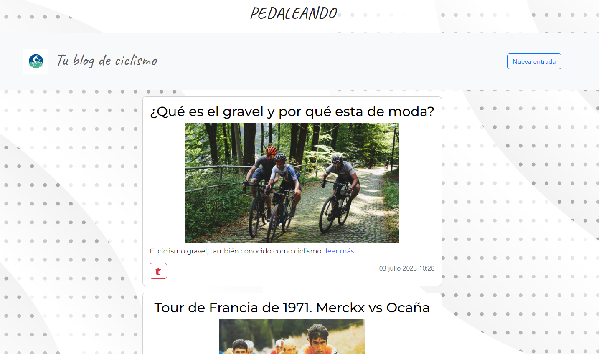
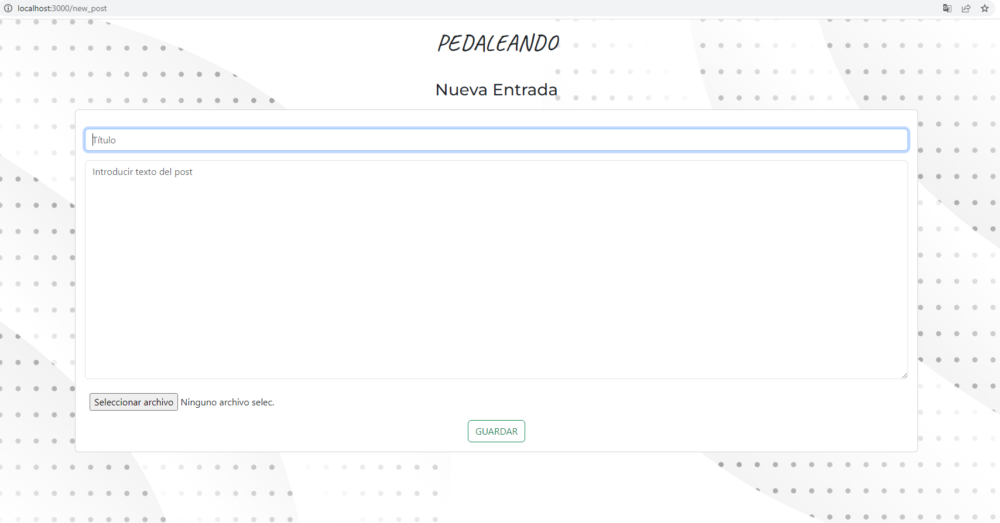
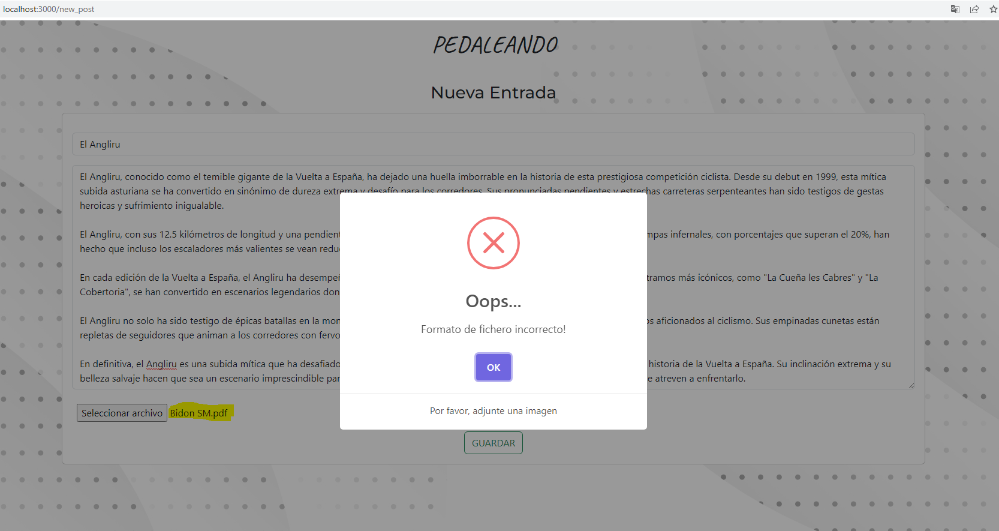
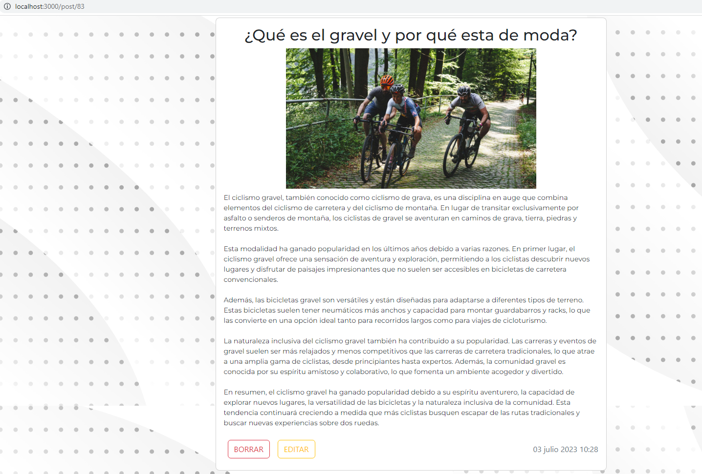
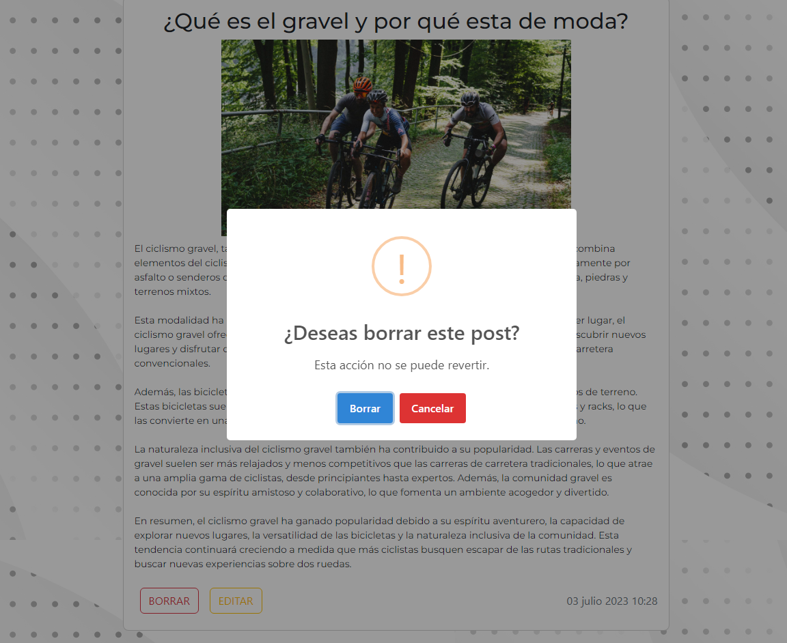
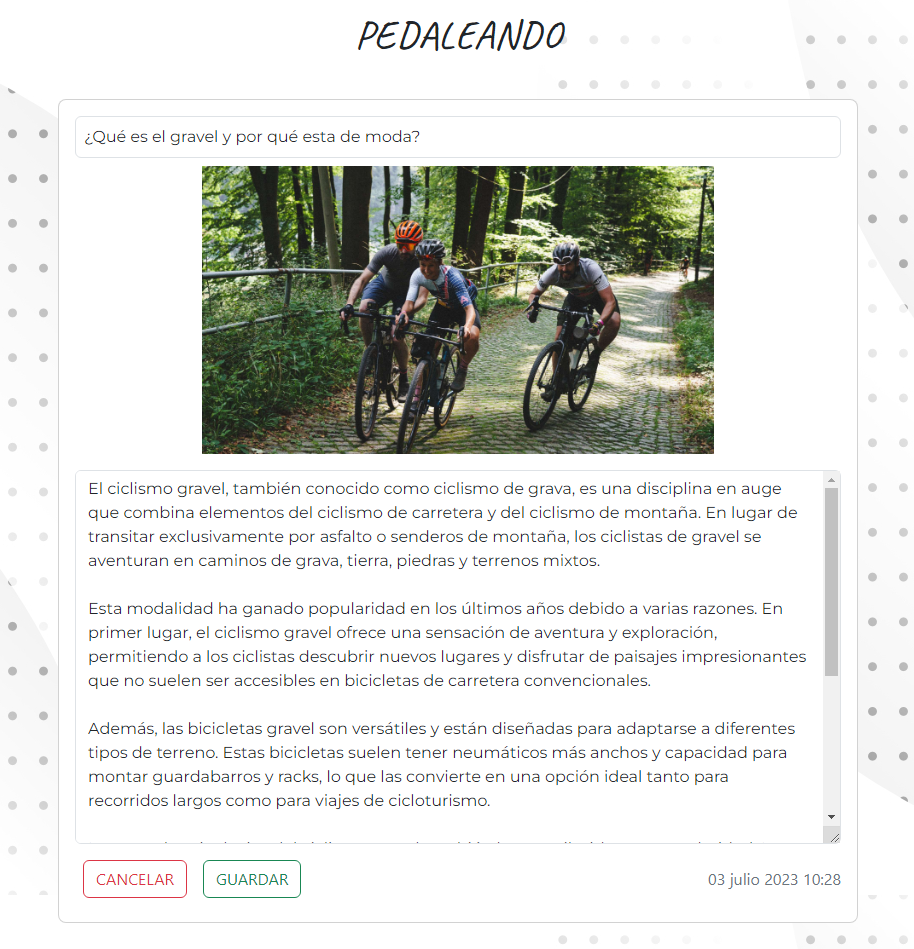
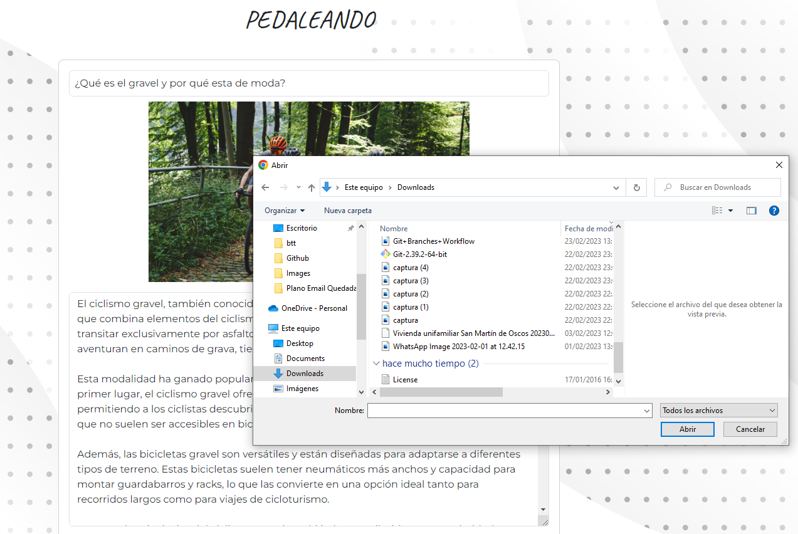
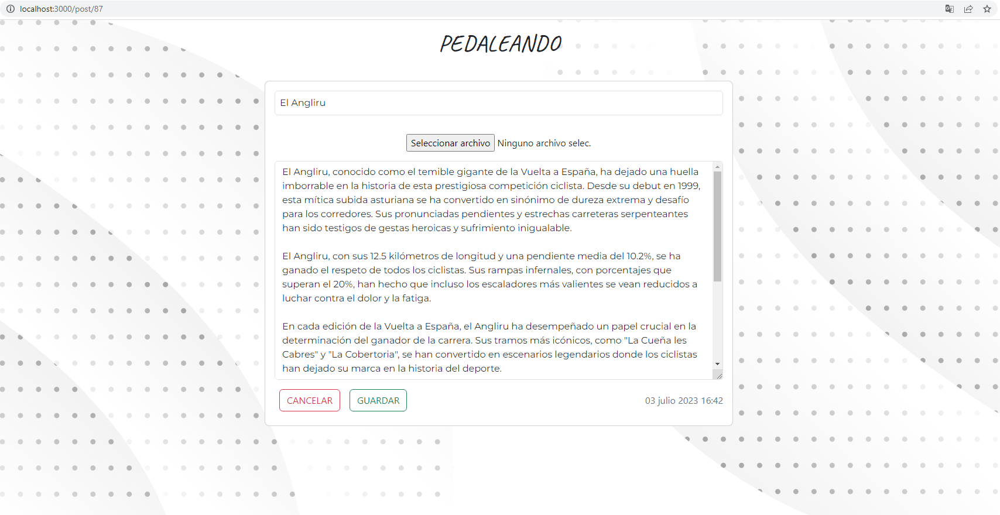
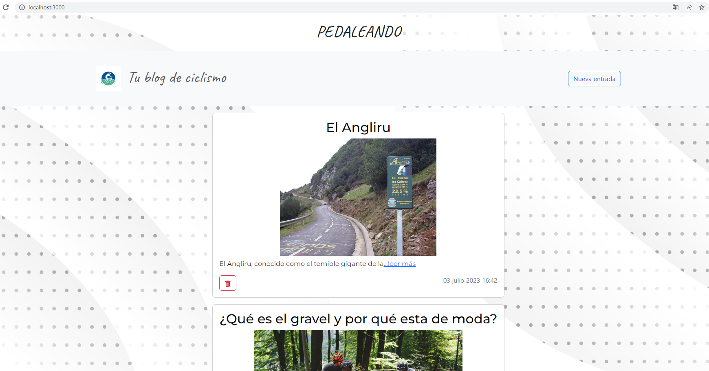

# **_PEDALEANDO_**

## Indice

- [**_PEDALEANDO_**](#pedaleando)
  - [Indice](#indice)
- [Introducción](#introducción)
  - [**Objetivo**](#objetivo)
  - [**Descripción**](#descripción)
  - [**Inicializar**](#inicializar)
    - [_Tecnologías_](#tecnologías)
    - [_Dependencias_](#dependencias)
    - [_Instalación_](#instalación)
    - [_Base de datos_](#base-de-datos)
    - [_Ejecución_](#ejecución)
- [Estructura del proyecto](#estructura-del-proyecto)
  - [**Server**](#server)
    - [_App.js_](#appjs)
    - [_Database_](#database)
    - [_Routes_](#routes)
    - [_Middleware_](#middleware)
    - [_Controllers_](#controllers)
    - [_Services_](#services)
    - [_Settings_](#settings)
    - [_Images_Uploaded_](#images_uploaded)
  - [**Client**](#client)
    - [_Common_](#common)
    - [_layouts_](#layouts)
    - [_views_](#views)
    - [_components_](#components)
    - [_css_](#css)
    - [_Public_](#public)
- [Uso](#uso)
  - [**Feed**](#feed)
  - [**Nueva Entrada**](#nueva-entrada)
  - [**Post**](#post)
  - [**Mejoras**](#mejoras)
  - [**_Autor: David Arango_**](#autor-david-arango)

# Introducción

## **Objetivo**

Blog sencillo con un sistema CRUD (Create, Read, Update,
Delete). Es decir, tendremos un sistema que nos permite crear entradas y que
salgan en loop en el feed de la home, editar esa misma entrada y poder
eliminarla, todo de manera dinámica

## **Descripción**

Las entradas se guardarán en una base de datos con MySQL, crearemos una
tabla llamada “posts” para ello.
Las imágenes tendremos que guardarlas en el servidor (carpeta pública) y
guardar su ruta en la tabla de “posts” para luego poder mostrar la imagen
correctamente (en el src=”” de la etiqueta img)
El diseño es libre salvo lo que requiere contener cada apartado, aparte del esqueleto HTML y que el feed esté centrado en la pantalla. Tiene que ser
responsive.

## **Inicializar**

### _Tecnologías_

- NodeJS
- React
- CSS (bootstrap).
- HTML
- MySQL
- Sequelize

### _Dependencias_

- Colocar el .env del Server en la raiz del proyecto: _Server/.env_

- Server:

  - "cors": "^2.8.5",
  - "dotenv": "^16.3.1",
  - "express": "^4.18.2",
  - "multer": "^1.4.5-lts.1",
  - "mysql2": "^3.4.2",
  - "nodemon": "^2.0.22",
  - "sequelize": "^6.32.1"

- Client:
  - "@testing-library/jest-dom": "^5.16.5",
  - "@testing-library/react": "^13.4.0",
  - "@testing-library/user-event": "^13.5.0",
  - "bootstrap": "^5.3.0",
  - "bootstrap-icons": "^1.10.5",
  - "eslint-config-react-app": "^7.0.1",
  - "moment": "^2.29.4",
  - "react": "^18.2.0",
  - "react-bootstrap": "^2.8.0",
  - "react-bootstrap-icons": "^1.10.3",
  - "react-dom": "^18.2.0",
  - "react-router-dom": "^6.14.0",
  - "react-scripts": "5.0.1",
  - "sweetalert2": "^11.7.12",
  - "web-vitals": "^2.1.4"

### _Instalación_

- Instalar dependencias del Server:
  - cd Server
  - npm i
- Instalar dependencias del Cliente:
  - cd Client
  - npm i

### _Base de datos_

- Database name: blog_db

Database desarrollada con MySql, usando Sequelize como ORM, por tanto se prescinde
de sentencias SQL. La base de datos se levanta al iniciar el servidor, si bien en
la primera ejecución es necesario ejecutar el Script adjunto en _Server/database/blog_db.sql_ ya que la incialización de la base de datos en el servidor esta configurada como _sync() - This creates the table if it doesn't exist (and does nothing if it already exists)_.
El script adjunto ya contiene una serie de posts precargados para probar la aplicación

### _Ejecución_

- Ejecutar el script de la BBDD

- Server:

  - cd Server
  - node _Server/app.js_

- Client:
  - cd Client
  - npm start

**_Se aconseja realizar la siguiente ejecución:_**

- Ejecución desde la sección "**_RUN AND DEBUG_**"
  - Seleccionar " Server + Client "

# Estructura del proyecto

## **Server**

La carpeta Server contiene todo el código correspondiente a la parte del servidor.

Está estructurado de la siguiente manera:

- App.js
- Database
  - Models
- Routes
- Middleware
- Controllers
- Services
- Settings
- Images_Uploaded

### _App.js_

Fichero donde se inicializa el Servidor y se establecen las diferentes configuraciones para el mismo.

### _Database_

Contiene los modelos de las distintas entidades que se persisten en la base de datos.
Además aquí se encuentra el fichero que realiza la conexión con la base de datos mediante Sequelize, y el script necesario para iniciar la BD antes de la primera ejecución de la aplicación.

### _Routes_

Se establecen las diferentes rutas para los endpoints de la API.

### _Middleware_

Ficheros de comprobación. En este caso se realizan comprobaciones de que el archivo adjunto se trata de una imagen.

### _Controllers_

Contiene la lógica detrás de las validaciones de las peticiones HTTP al servidor, enviando la respuesta correspondiente al Client dependiendo de cada situación.
Se comunica con los Services.

### _Services_

Acciones del Server contra la base de datos. Se establecen aquí todas las peticiones que el servidor realiza a la base de datos.

### _Settings_

Fichero de configuración que hace uso del fichero .env

### _Images_Uploaded_

Carpeta del servidor donde se guardan las imagenes adjuntas a cada Post.

## **Client**

La carpeta Client contiene todo el código correspondiente a la UI.

Está estructurado de la siguiente manera:

- src
  - App.jsx
  - common
  - layouts
  - views
  - components
    - common
      - Feed
      - Post
      - NewPost
  - css
- public
  - images

### _Common_

Fichero con valores constantes a lo largo del proyecto.

### _layouts_

Layouts utilizados. Sobre ellos se van renderizando los compenentes necesarios en cada ruta.

### _views_

Se desarrolla cada unade las vistas correspondientes a cada una de las rutas que forman parte de la aplicación.

### _components_

Componentes usados a lo largo de la aplicación. Se subdivide en:

- common: componentes reutilizados en varias vistas. Se utilizan en los layouts.
- Feed: componentes del Feed. Se usan en la vista Feed.
- NewPost: componentes para crear un nuevo post. Se usan en la vista NewPost
- Post: Componentes para renderizar el post y edición. Se usan en la vista Post

### _css_

Ficheros de estilos.

### _Public_

Contiene las imagenes, backgrounds e iconos de la aplicación.

# Uso

## **Feed**

Una vez inicializado el proyecto, lo primero que tenemos es el **FEED**. En esta sección se renderizan las diferentes entradas de las que se compone el Blog.
En la parte superior tenemos la barra de navegación desde la que se puede crear una **Nueva Entrada**.
Las diferentes entradas se renderizan con un resumen de las mísmas, siendo posible acceder a la entrada completa pulsando sobre el título, la imagen o el _...leer más_.
Además en cada entrada se muestra su fecha y hora de publicación y hay un botón para **BORRAR** la entrada (previa confirmación en el popup emergente.)

## **Nueva Entrada**

Desde aqui podemos introducir una nueva entrada. Se dispone de campos para el título de la entrada y para el contenido. Además se puede adjuntar la imagen a la entrada si se desea (no es obligatorio). Al adjuntar la imagen se realiza una comprobación de que se trata de un fichero de formato Imagen, saliendo un mensaje de error en caso de que no lo sea.
Una vez introducida la nueva entrada será almacenada en la DB y la imagen en la carpeta disponible en el servidor para almancenar las imagenes.

## **Post**

En la vista **POST** se muestra toda la entrada completa. En esta vista se incluye un botón de para **BORRAR** la entrada y otro **EDITAR** para activar el modo de edición.
Pulsando sobre el botón de **BORRAR** aparecerá el siguiente mensaje para la confirmación de la acción. Si se confirma, se borra la entrada y la imagen de la carpeta del servidor donde se encuentra almacenada.

Pulsando sobre el botón de **EDITAR** se activa el modo Edición, el cual sobre la misma ruta carga la entrada de manera que los campos pasen a ser editables. Además aparece el botón de **Guardar** o **Cancelar**.

Tenemos dos posibilidades de edición:

- si la entrada ha sido creada ya con imagen adjunta, entonces pulsando sobre la imagen se podrá cambiar la imagen (En caso de cambiarla, la imagen anterior se borra de la carpeta donde está almacenada en el Server.)

- Si la entrada se creó sin imagen, tenemos un botón para añadir una imagen.

Se adjunta la imagen y se guarda junto con la entrada.

## **Mejoras**

- Implementar comprobaciones en el servidor de los datos introducidos.
- Implementar usuario administrador, que pueda realizar todas las operaciones CRUD, y usuario sin privilegios de administrador, que solo pueda leer los mensajes.
- Implementar la opción de eliminar la imagen de un post.
- Implementar la opciónd de adjuntar más de una imagen.

## **_Autor: David Arango_**
